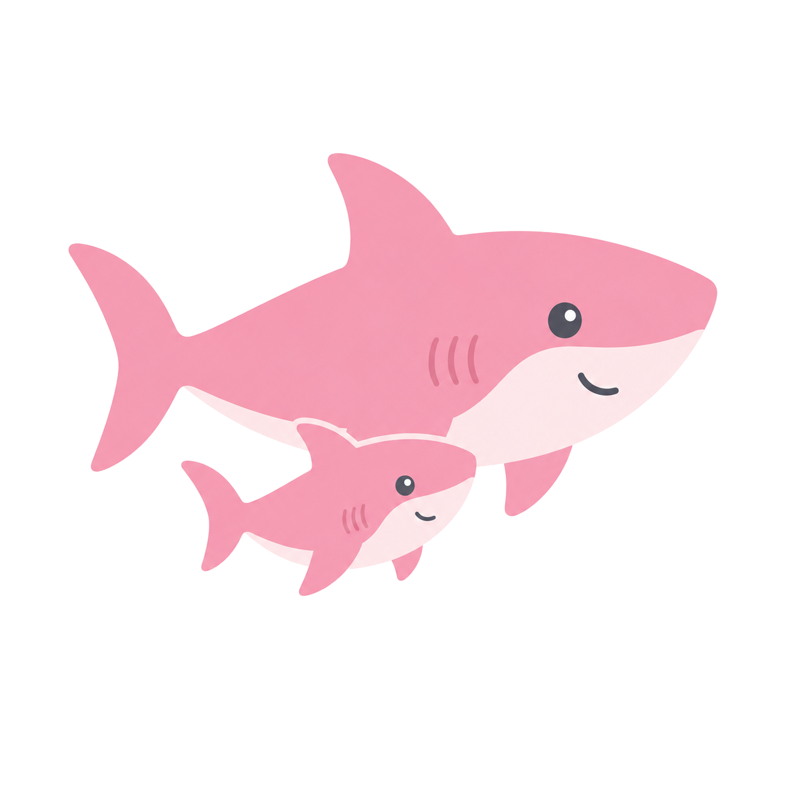

# Маячок · Mayachok

**Libre postpartum depression screening. Anonymous by default. Works everywhere.**

Mayachok administers the Edinburgh Postnatal Depression Scale (EPDS) — a
validated 10-question clinical instrument used worldwide — and returns a
structured score with clear guidance.

It is not an AI. It does not generate advice. It runs a questionnaire and
returns a number. That number can save lives.

**License:** AGPL-3.0

---

## Why

Postpartum depression affects roughly 1 in 7 mothers. It often goes undetected
because nobody asks the right questions. Mayachok gives mothers a private,
low-friction way to screen themselves.

Designed to work anywhere — on any device, in any language, with or without internet.



---

## Stack

Clojure · Kit · Integrant · Reitit · HugSQL · SQLite · Selmer · Bulma CSS

---

## Getting Started

Requires Java 11+ and the [Clojure CLI](https://clojure.org/guides/install_clojure).

```bash
git clone https://github.com/doctorkotik187/mayachok
cd mayachok
clj -M:dev
```

Then in the REPL: `(go)` / `(halt)` / `(reset)`

---

## Features

- Full EPDS with correct scoring (reverse-scored Q1, Q2, Q4)
- Q10 safety alert — always surfaces for self-harm ideation
- Anonymous optional survey (age range, time since birth, first child)
- Optional location input for aggregate regional statistics
- Aggregate statistics API (`/api/stats`)
- Heatmap page showing regional data
- Crisis resources page (`/help`)
- PDF export of results
- PWA — installable, works offline
- Dark mode support
- 4 languages: Russian, English, German, Ukrainian

---

## API

- `POST /api/screenings` — submit a screening
- `GET /api/screenings/:id` — fetch a screening
- `GET /api/stats` — aggregate statistics
- `GET /api/health` — health check with version
- Swagger docs at `/api/api-docs/index.html`

---

## Self-Hosting

1. Build: `clojure -T:build uber`
2. Run: `java -jar target/mayachok-standalone.jar`
3. SQLite DB is created automatically
4. Optional: set `JDBC_URL` for a custom DB path

---

## Contributing

Clinical contributions welcome — especially translation review, EPDS validation
citation checking, and crisis resource links for your region.

All scoring logic changes require a corresponding test. EPDS question wording
changes should cite the published validated translation.

See [`AGENTS.md`](./AGENTS.md) for architecture details.

---

## Credits

- **Pink Sharky** — mascot and friend
- **Bulma CSS** — for making the internet prettier
- **EPDS** — Cox, Holden & Sagovsky (1987)

## License

[AGPL-3.0](./LICENSE)

---

*"The first thousand days of a child's life begin with a healthy mother."*
